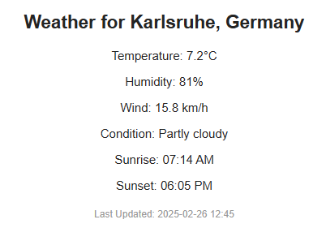
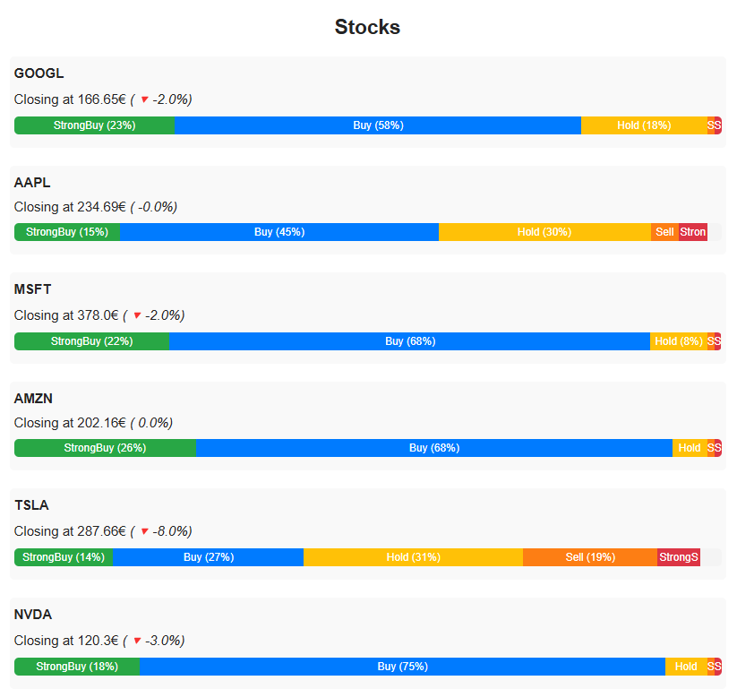
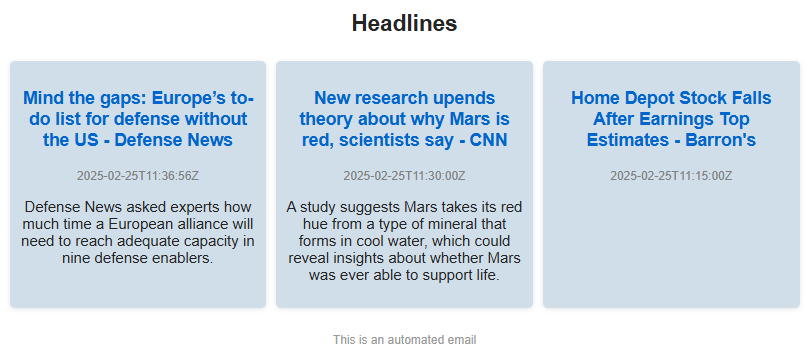

# Automatic Reporting Mail Service

## Project Overview

The `Automatic Reporting Mail Service` fetches weather, astronomy, and stock data from various `APIs`, processes the data, and sends a formatted email report to a specified email address. The service is designed to run automatically at a specified time each day on a `Raspberry Pi`.

## Dependencies

- Python 3.x
- `requests`
- `yfinance`

## Configuration

Edit the `config.py` file to include your API keys, email address, and Gmail password.

```python
from datetime import datetime

QUERY = "Karlsruhe"  # City for which to fetch weather and astronomy data
WEATHER_URL = "http://api.weatherapi.com/v1/current.json"  # URL for Weather API
ASTRONOMY_URL = "http://api.weatherapi.com/v1/astronomy.json" # URL for Astronomy API
WEATHER_API_KEY = ""  # API key for Weather API

EMAIL_FROM = ""                 # Email adress for sending emails
EMAIL_TO = ""                   # Email adress for sending emails
EMAIL_PWD = ""                  # Password set in Google account settings
SMTP_SERVER = "smtp.gmail.com"  # SMTP server for sending emails
SMTP_PORT = 587                 # Standard port for email submission

TICKER_LIST = ["GOOGL", "AAPL", "MSFT", "AMZN", "TSLA", "NVDA"]     # List of stock tickers to fetch data for
TODAY = datetime.now().strftime("%Y-%m-%d")                         # Get today's date in format "YYYY-MM-DD"

HEADLINES_URL = "https://newsapi.org/v2/top-headlines"  # URL for News API
HEADLINES_API_KEY = ""  # API key for News API
HEADLINES_COUNTRY = "us"                                # Country code to fetch headlines for
HEADLINES_CATEGORY = "general"                          # News category to fetch headlines for 
```

## Installation

1. Clone the repository:
    ```sh
    git clone https://github.com/yourusername/Automatic-Reporting-Mail-Service.git
    cd Automatic-Reporting-Mail-Service
    ```

2. Install the required dependencies:
    ```sh
    pip install -r requirements.txt
    ```

## Usage

Run the script:
```sh
python main.py
```

or schedule the script to run automatically at a specified time each day using `cron`


## Email Body Examples

### Weather Report


### Stocks Report


### Headlines Report


